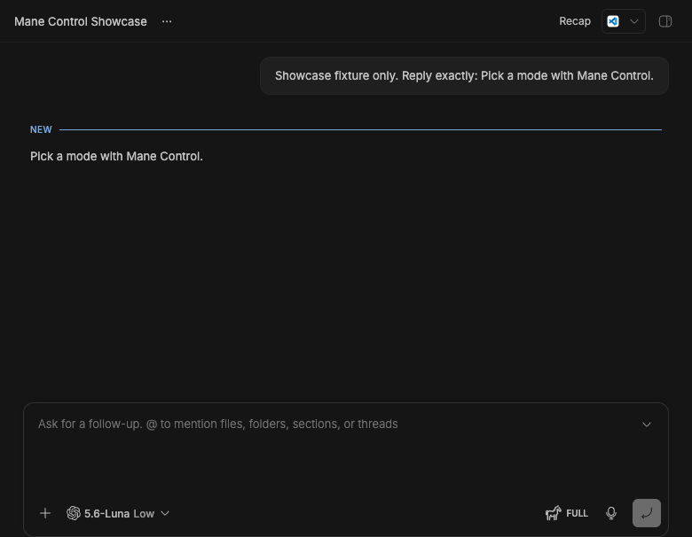
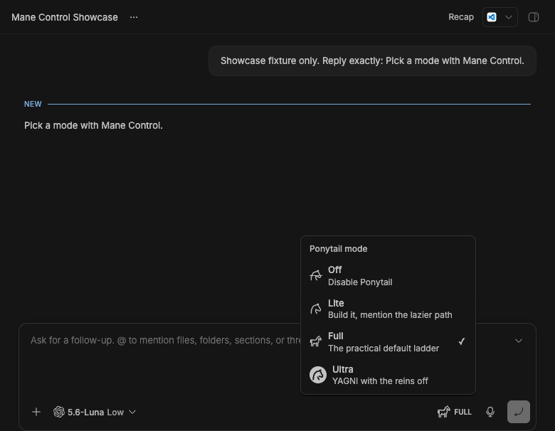
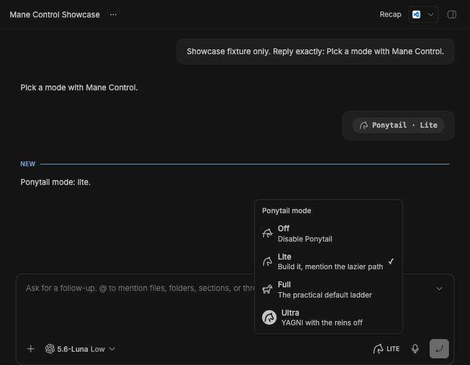
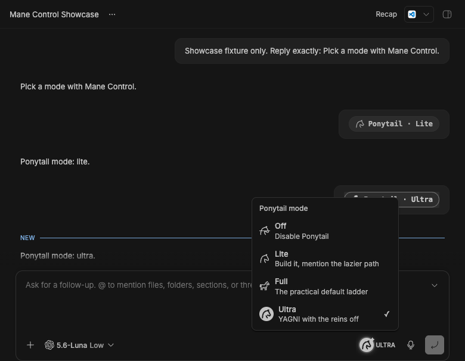

# Mane Control

> Requires [Ponytail](https://github.com/DietrichGebert/ponytail) to be installed
> and enabled for the thread's provider environment. Mane Control detects the
> `ponytail` skill and blocks mode changes when the prerequisite is missing.

A tiny BB plugin that puts a horse button beside the thread composer. Its menu
immediately switches Ponytail between Off, Lite, Full, and Ultra, and shows the
current selection on the trigger. Mode-command messages render as compact
`Ponytail · Mode` status pills while retaining the real command underneath.

## Showcase

These headless Playwright captures show the plugin running inside BB. The
thread content is disposable fixture data; the interface and plugin are real.





### Switch to Lite

The real menu action updates both the styled thread message and the current
mode shown by the composer control.



### Switch to Ultra

Switching again preserves the visible mode history and moves the menu's current
selection to Ultra.



## Project layout

- `src/` — BB server and app entries
- `src/lib/` — shared mode parsing and types
- `test/` — backend and message-recognition checks
- `assets/` — theme-aware horse icons
- `output/playwright/` — privacy-safe captures from the running BB app

```sh
npm install
npm test
npm run check
npm run build
bb plugin install .
```
