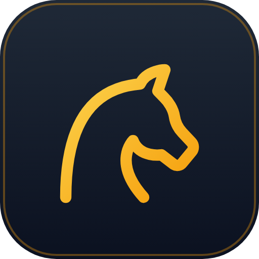
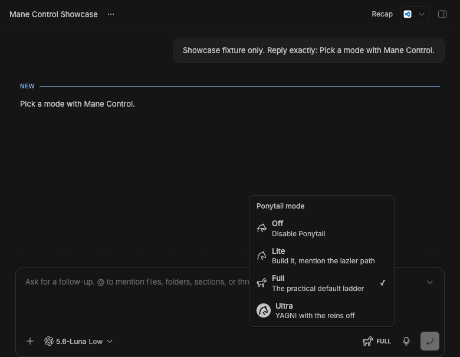

<div align="center">



# Mane Control

**Switch [Ponytail](https://github.com/DietrichGebert/ponytail) modes from the thread composer — no slash commands.**

[](https://github.com/MacHatter1/bb-plugin-mane-control)
[](package.json)
[](https://github.com/DietrichGebert/ponytail)
[](LICENSE)



</div>

## What it does

A horse button sits beside the thread composer. Open it, pick a mode, and the
matching `/ponytail` command goes into the thread straight away — the button
keeps the active mode in view, and its icon changes with it.

| Mode | Sends | Ponytail behaviour |
| --- | --- | --- |
| Off | `/ponytail off` | Disable Ponytail |
| Lite | `/ponytail lite` | Build it, mention the lazier path |
| Full | `/ponytail full` | The practical default ladder |
| Ultra | `/ponytail ultra` | YAGNI with the reins off |

Mode commands in the transcript collapse into compact `Ponytail · Mode` status
pills, with the real command still available underneath.

## Install

```sh
bb plugin install https://github.com/MacHatter1/bb-plugin-mane-control
```

[Ponytail](https://github.com/DietrichGebert/ponytail) must also be installed
and available for the thread's provider. Mane Control accepts the Ponytail
plugin skill, a user skill, or a registry install such as skills.sh. When
Ponytail is missing, the control stays disabled and mode changes are blocked.

Requires BB `>= 0.40`.

## Screenshots

These use disposable fixture data in a real BB thread.

| Thread control | Lite mode | Ultra mode |
| --- | --- | --- |
|  |  |  |

## Development

```sh
npm install
npm test
npm run check
npm run build
bb plugin install .
```

- `src/` — BB server and app entries
- `src/lib/` — shared mode parsing and types
- `test/` — backend and message-recognition checks
- `assets/` — theme-aware horse icons, logo, social preview
- `PLUGIN_OVERVIEW.md` — long-form store overview
- `output/playwright/` — privacy-safe captures from the running BB app

## License

[MIT](LICENSE)
