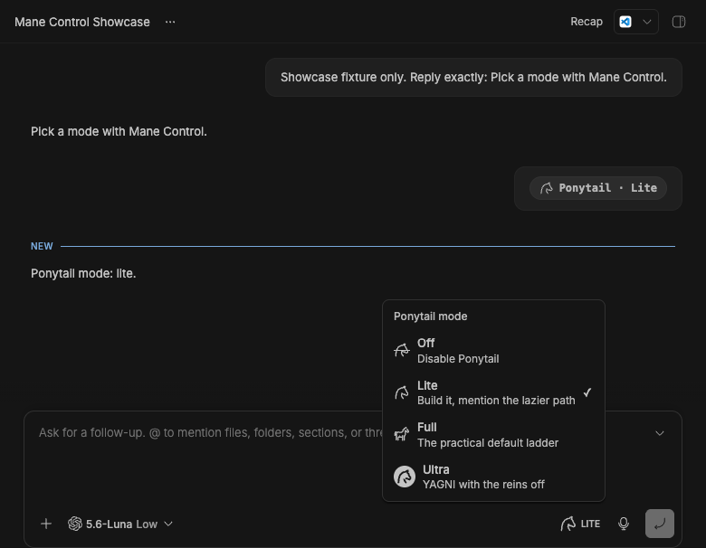
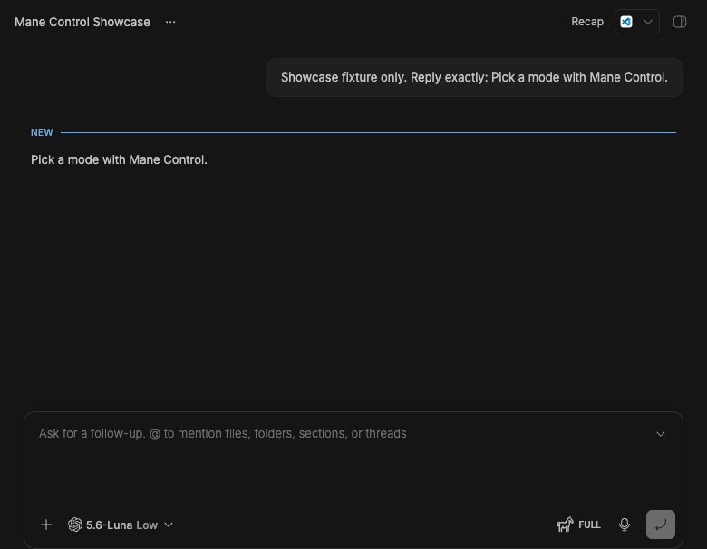
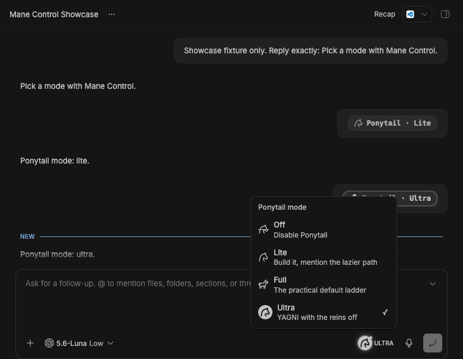
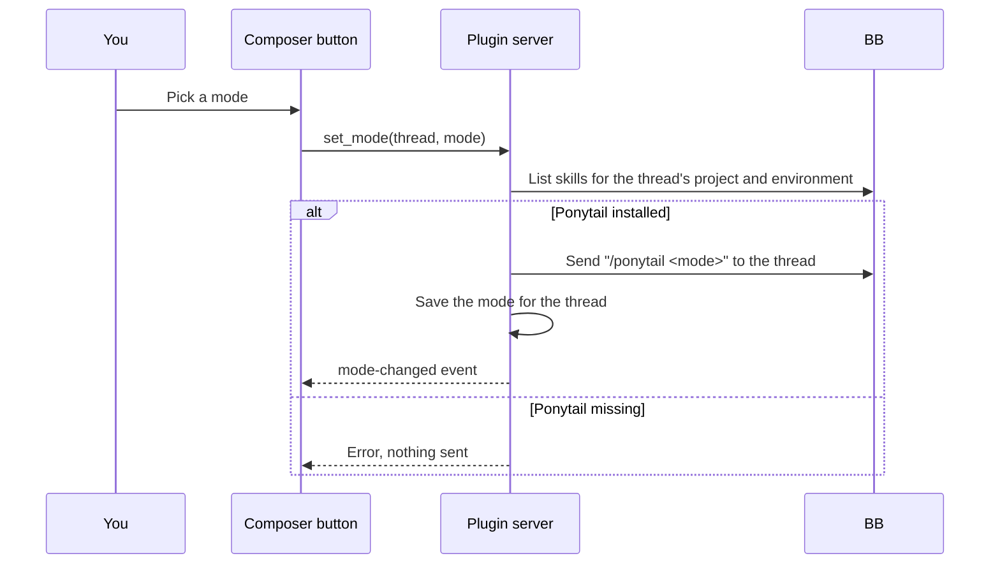

<div align="center">


# Mane Control

### Switch Ponytail modes without typing a slash command.

A horse button beside the thread composer switches [Ponytail](https://github.com/DietrichGebert/ponytail) between Off, Lite, Full and Ultra.<br>
You see the thread's mode at a glance, and mode changes show up in the transcript as small pills.


[Features](#features) · [Install](#install) · [How it works](#how-it-works) · [Development](#development)

<br>



</div>

<br>

> [!NOTE]
> The screenshots are real BB captures populated with fictional demo data.

## The problem

Ponytail has four modes, and you switch between them by typing
`/ponytail lite` or `/ponytail ultra` into the thread. Halfway through a
session, you have to remember the exact words. Nothing on screen tells you
which mode the thread is in, and the commands sit in the transcript as plain
messages among the real work.

Mane Control puts the four modes in a menu beside the composer. Pick one and it
sends the command for you. The button shows the mode, and the command shows up
in the transcript as a small labelled pill.

|  | Without Mane Control | With Mane Control |
| --- | :---: | :---: |
| Switch modes | Type `/ponytail <mode>` | ✅ Pick from a menu |
| See the thread's mode | ❌ | ✅ On the button |
| Mode changes in the transcript | Plain messages | ✅ `Ponytail · Mode` pills |
| Guard against a missing Ponytail | ❌ | ✅ Nothing is sent |

## Features

<table>
<tr>
<td width="50%" valign="top">

### 🐴 A mode menu by the composer

Open the horse button and pick Off, Lite, Full or Ultra. Mane Control sends the
matching `/ponytail` command into the thread straight away. Picking the mode
you are already in sends nothing.

</td>
<td width="50%" valign="top">

### 👀 The mode stays in view

The button labels the thread's mode, and its icon changes with it: a crossed-out
head for Off, a head for Lite, a whole horse for Full and a glowing badge for
Ultra. Each thread keeps its own mode.

</td>
</tr>
<tr>
<td valign="top">

### 🏷️ Pills in the transcript

A message that is nothing but `/ponytail <mode>` renders as a compact
`Ponytail · Mode` pill with the mode's icon. The command text stays in the page
underneath.

</td>
<td valign="top">

### 🧩 Works with any Ponytail install

Mane Control finds Ponytail as the Ponytail plugin, a user skill, or a registry
install such as skills.sh. Without it, the button reads **REQUIRED** and stays
disabled.

</td>
</tr>
</table>

<div align="center">
<table>
<tr>
<td align="center"><br><sub><b>At rest: the button shows the mode</b></sub></td>
<td align="center"><br><sub><b>Ultra, with its glowing badge</b></sub></td>
</tr>
</table>
</div>

## Install

```sh
bb plugin install git:https://github.com/MacHatter1/bb-plugin-mane-control --yes
```

That's it. The horse button appears beside the composer in every thread.

<details>
<summary><b>Install from a local clone</b></summary>

```sh
git clone https://github.com/MacHatter1/bb-plugin-mane-control
cd bb-plugin-mane-control
npm install && bb plugin build
bb plugin install path:$PWD --yes
```

</details>

**Requirements**

- bb **0.40+** (Plugin SDK 0.4.21+)
- [Ponytail](https://github.com/DietrichGebert/ponytail), installed as the
  Ponytail plugin, a user skill, or from a registry such as skills.sh

## Where to find it

| Where | What |
| --- | --- |
| **Thread composer** | The horse button among the composer's actions. Click it to pick a mode. It appears in existing threads, not in the new-thread composer. |
| **Thread transcript** | A `Ponytail · Mode` pill wherever a mode command was sent. |

## How it works


```mermaid
sequenceDiagram
    participant You
    participant Button as Composer button
    participant Server as Plugin server
    participant BB
    You->>Button: Pick a mode
    Button->>Server: set_mode(thread, mode)
    Server->>BB: List skills for the thread's project and environment
    alt Ponytail installed
        Server->>BB: Send "/ponytail <mode>" to the thread
        Server->>Server: Save the mode for the thread
        Server-->>Button: mode-changed event
    else Ponytail missing
        Server-->>Button: Error, nothing sent
    end
```

- **One message per pick.** Each pick sends a single `/ponytail <mode>`
  message, and Ponytail does the rest. Mane Control does not touch Ponytail's
  files or settings.
- **One mode per thread.** The last mode you pick is saved in the plugin's own
  storage, keyed by thread. A thread you have not changed shows Full,
  Ponytail's default.
- **It only knows what it sent.** Mane Control does not read Ponytail's state.
  If you type `/ponytail` yourself, the message still becomes a pill, but the
  button keeps showing the last mode it set.
- **Live in every window.** After a change, the server publishes a
  `mode-changed` event, so every open composer refreshes its button.
- **Pills are styling only.** A content script marks messages whose whole text
  is `/ponytail <mode>`, in any case, and CSS draws the pill. Disabling the
  plugin removes the styling.

## Safe by default

- ✋ **Sends only when you pick.** Nothing is sent when a thread opens, and
  picking the mode already active sends nothing.
- 🔒 **Checks for Ponytail first.** The server refuses a mode change when
  Ponytail is not installed for the thread, so the command never reaches an
  agent that cannot use it.
- 🧵 **Stays in its thread.** It only sends to the thread whose composer you
  used.
- 📦 **Stores one word per thread.** The mode name is all it saves. It reads
  and writes no files and makes no network requests of its own.

## Development

```sh
npm install
npm test
npm run check                      # typecheck
bb plugin build
bb plugin install path:$PWD --yes
bb plugin dev                      # rebuild and reload on every save
```

```
src/server.ts        RPC (get_mode, set_mode) and the Ponytail check
src/app.tsx          composer button and transcript pills
src/styles.css       pill styling
src/lib/             mode list, command matching, skill detection
test/                server and matching tests
assets/              horse icons, logo and social card
output/playwright/   README screenshots
```

**Tests** run under Node's type stripping, with no test runner. They cover
command matching and Ponytail detection, and drive the server through the
Plugin SDK's fake plugin host: reading and setting a mode, the exact message
sent, and the refusal when Ponytail is missing.

`PLUGIN_OVERVIEW.md` is the store listing. Keep it in step with
`bb.description` in `package.json`.

## Licence

[MIT](LICENSE)
